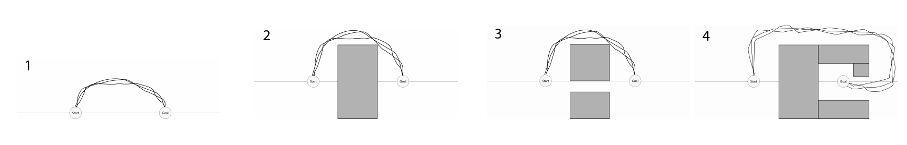
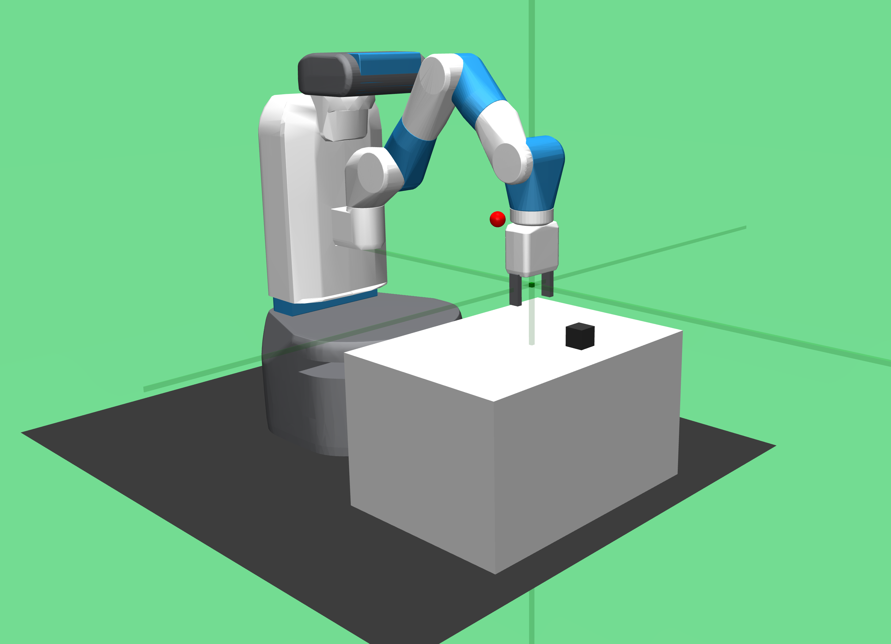

# Extending Deep Model Predictive Control with Safety Augmented Value Estimation from Demonstrations

<p align=center>


</p>

<p align="center">
  <a href="https://arxiv.org/pdf/1905.13402.pdf">View on ArXiv</a>
  |
  <a href="https://sites.google.com/view/safetyaugmentedvalueestimation/home">View website</a>
</p>

**Abstract:** Reinforcement learning (RL) for robotics is challenging due to the difficulty in hand-engineering a dense cost function, which can lead to unintended behavior, and dynamical uncertainty, which makes it hard to enforce constraints during learning. We address these issues with a new model-based reinforcement learning algorithm, safety augmented value estimation from demonstrations (SAVED), which uses supervision that only identifies task completion and a modest set of suboptimal demonstrations to constrain exploration and learn efficiently while handling complex constraints. We derive iterative improvement guarantees for SAVED under known stochastic nonlinear systems. We then compare SAVED with 3 state-of-the-art model-based and model-free RL algorithms on 6 standard simulation benchmarks involving navigation and manipulation and 2 real-world tasks on the da Vinci surgical robot. Results suggest that SAVED outperforms prior methods in terms of success rate, constraint satisfaction, and sample efficiency, making it feasible to safely learn complex maneuvers directly on a real robot in less than an hour. For tasks on the robot, baselines succeed less than 5% of the time while SAVED has a success rate of over 75% in the first 50 training iterations.

## Requirements

The provided environments require MuJoCo 1.50.1.68. Other dependencies can be installed with `pip install -r requirements.txt`. We recommend installing everything in a Python 3.6 virtual environment.

## Running Experiments

Experiments for a particular environment can be run using:

```
python scripts/mbexp.py
    -env    ENV       (required) The name of the environment. Select from
                                 [cartpole, reacher, pusher, halfcheetah].
    -ca     CTRL_ARG  (optional) The arguments for the controller
                                 (see section below on controller arguments).
    -o      OVERRIDE  (optional) Overrides to default parameters
                                 (see section below on overrides).
    -logdir LOGDIR    (optional) Directory to which results will be logged (default: ./log)
```

To run experiments with default arguments to reproduce our results, only specify the environment (and optionally a log directory). For example: `python scripts/mbexp.py -env reachersparse`.

Results will be saved in `<logdir>/<date+time of experiment start>/`.
Trial data will be contained in `logs.mat`, with the following contents:

```
{
    "observations": NumPy array of shape
        [num_train_iters * nrollouts_per_iter + ninit_rollouts, trial_lengths, obs_dim]
    "actions": NumPy array of shape
        [num_train_iters * nrollouts_per_iter + ninit_rollouts, trial_lengths, ac_dim]
    "costs": NumPy array of shape
        [num_train_iters * nrollouts_per_iter + ninit_rollouts, trial_lengths, 1]
    "returns": Numpy array of shape [1, num_train_iters * neval]
}
```

We currently only provide code for simulated experiments from the SAVED paper. Support for physical experiments is coming soon.

#### Rendering

A script for visualizing a rollout with a trained model is also provided for convenience, and can be run using `python scripts/render.py`. Usage is similar to `mbexp.py`, with an additional argument `-model_dir <path to directory containing saved model files>`. The provided directory must contain `model.mat` and `model.nns`.

### Controller Arguments

To specify controller arguments `-ca`, choose among the following options:

```
model-type : The model that will be used. Select from [D, P, DE, PE]. Defaults to PE.
             D indicates deterministic networks, P indicates probabilistic networks, and E indicates
             ensembling.
prop-type  : The propagation method that will be used. Select from [E, DS, TS1, TSinf, MM].
             Defaults to TSinf. E indicates deterministic, DS is distribution sampling, TS*
             are trajectory sampling methods, and MM is moment matching.
opt-type   : The optimizer that will be used to select action sequences. Select from [Random, CEM].
             Defaults to CEM (cross-entropy method).
```

### SAVED Parameters

Update experiment parameters in `dmbrl/config/{env}.py`. For example, to set SAVED parameters
for the Reacher environment, modify the experiment parameters in `dmbrl/config/reachersparse.py`
All of the navigation parameters are located in `dmbrl/config/pointbot.py`

## Plotting Results

Example plotting code is in `scripts/analyze_logs.py`

## Questions and Issues
To report issues, please open an issue on the Issues page.

This code was built on top of the <a href="https://github.com/kchua/handful-of-trials">handful-of-trials repository.</a>
